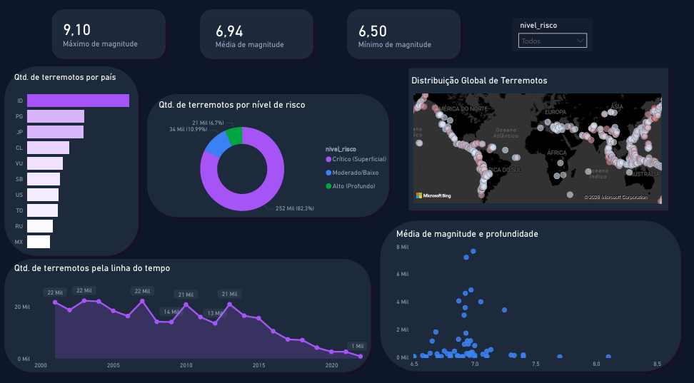
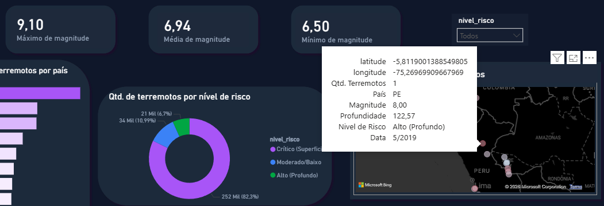
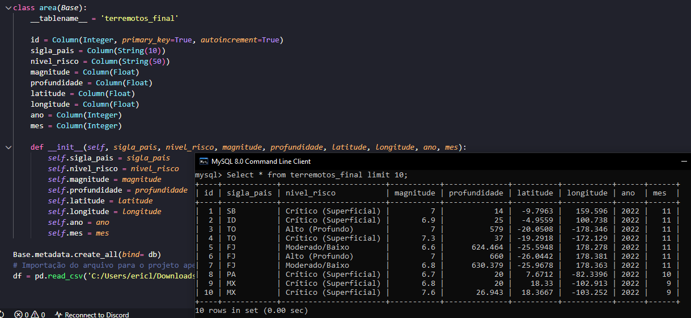

# Pipeline de ETL para análise de dados sísmicos integrando Python, MySQL e Power BI

Analisar tendências de terremotos e tsunamis ao redor do mundo. | Demonstrar a automação do tratamento de dados com Pandas e persistência em banco de dados relacional.

## Descrição

O projeto de análise de risco sísmico global é um trabalho que foi feito entre 01/12/2025 – 22/01/2026. 

Seu objetivo é evidenciar com base em dados reais disponibilizados no site `Kaggle`, os riscos sísmicos em diversos países, fazendo comparações entre magnitudes e frequências similares até de extrema diferença, tudo em um ciclo completo de `ETL`, além disso, por motivos de perpetuação do código ele é integrado em um banco de dados no `mySQL` e para melhor visualização foi criado um dashboard interativo com o `Power BI` que foi alimentado com o banco de dados do `mySQL` feito em código com a biblioteca `sqlalchemy`. 

Tudo nesse projeto foi feito com minha base de conhecimento e estudos a fundo sobre as bibliotecas utilizadas. 
##Arquitetura do Projeto
O fluxo de dados segue a seguinte esteira:
1.  **Extract:** Leitura de dados brutos (CSV/Kaggle).
2.  **Transform:** Limpeza, filtragem, categorização de risco e Geocodificação Reversa (Python/Pandas).
3.  **Load:** Carga automatizada no banco de dados MySQL via SQLAlchemy.
4.  **Viz:** Conexão do Power BI com o MySQL para geração de Dashboards.
## Primeiros passos
### Dependências 
* Python
* IDE de sua escolha - Utilizada: VScode
* Jupyter notebook
* MySQL
* Power BI
* Git
### Instalação
Além do que está nas dependências, é necessário verificar o "requirements.txt" e instalar as bibliotecas com suas devidas versões para o funcionamento do código.

Instale as referências com `pip install -r requirements.txt`
### Execução

Instale e abra o bash do Git na pasta que desejar, execute o comando git clone. 

`git clone https://github.com/EricLdJ/Analise_Risco_Sismico_Global.git`

Ou se desejar, baixe o arquivo no github e abra o arquivo na sua IDE. 

Configure as Variáveis de Ambiente: Por segurança, as credenciais do banco não estão no código.

Crie um arquivo chamado .env na raiz do projeto.

Adicione suas credenciais do MySQL no seguinte formato:

**DB_USER=root**

**DB_SENHA=sua_senha_aqui**

Prepare o Banco de Dados: Abra seu terminal MySQL ou Workbench e crie o banco vazio:

**CREATE DATABASE projeto_terremotos;**

**Execute o Pipeline**: Execute célula por célula para compreender o funcionamento do código.
### Destaques Técnicos & Enriquecimento de Dados

O diferencial deste projeto foi a aplicação de técnicas avançadas de transformação de dados para gerar insights geográficos que não existiam na base original:

* **Data Enrichment (Reverse Geocoding):** A base original continha apenas coordenadas (Latitude/Longitude). Utilizei a biblioteca `reverse_geocoder` para mapear matematicamente cada ponto a seu respectivo país, permitindo análises de risco por nação (ex: "Quais países sofrem mais terremotos?").
* **Engenharia Geoespacial:** Utilização do `Shapely` e `GeoPandas` para converter dados tabulares simples em objetos geométricos (`Point`), possibilitando a plotagem precisa em camadas de mapas vetoriais.
* **Regra de Negócio:** Criação de colunas de categorização de risco baseadas na profundidade e magnitude, simulando um cenário real de classificação de perigo.

## Prints

### Dashboard interativo

Essa é a visão geral do dashboard, onde contém todas as informações necessárias para uma análise detalhada e dinâmica do visual.

### Mapa interativo

Funcionalidade de interatividade em tempo real, no momento em que pousar o mouse em cima de alguma bolha de foco as informações irão aparecer em forma de caixa, detalhando quando, onde, profundidade e a intensidade do terremoto.

### Banco de dados

Prova de que o banco de dados foi 100% criado em código python com a biblioteca sqlalchemy, além do seu total funcionamento.

## Autor
Eric Lima de Jesus 

email: ericlj333@gmail.com

LinkedIn: https://www.linkedin.com/in/eric-l-jesus/

